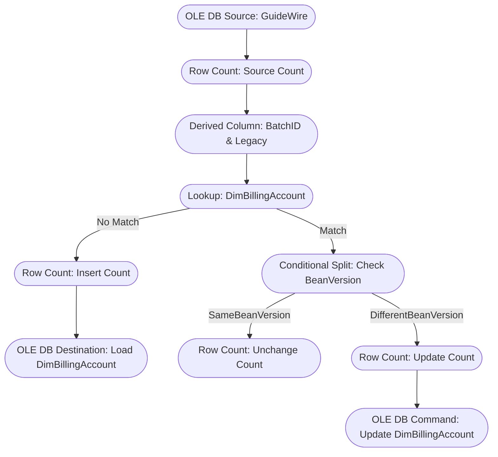

# EDW_BC_Load_DimBillingAccount Data Flow Documentation

## Data Flow Overview

## Source Tables

**All tables referenced in the OLE DB Source query and Lookup:**

- BC_ACCOUNT
- BCTL_ACCOUNTTYPE
- BC_PARENTACCT
- BC_ACCOUNTCONTACT
- BC_ACCOUNTCONTACTROLE
- BCTL_ACCOUNTROLE
- BC_CONTACT
- BC_ADDRESS
- BCTL_STATE
- BCTL_BILLINGLEVEL
- BCTL_CUSTOMERSERVICETIER
- BC_SECURITYZONE
- BCTL_DELINQUENCYSTATUS
- BCTL_ACCOUNTSEGMENT
- DIMBILLINGACCOUNT (Lookup)

## Joins

Joins as defined in OLE DB Source SQL and Lookup:

- BC_ACCOUNT LEFT JOIN BCTL_ACCOUNTTYPE ON BCTL_ACCOUNTTYPE.ID = BC_ACCOUNT.AccountType
- BC_ACCOUNT LEFT JOIN BC_PARENTACCT ON BC_PARENTACCT.OwnerID = BC_ACCOUNT.ID
- BC_PARENTACCT JOIN BC_ACCOUNT act ON act.ID = BC_PARENTACCT.ForeignEntityID
- BC_ACCOUNT LEFT JOIN BCTL_BILLINGLEVEL ON BCTL_BILLINGLEVEL.ID = BC_ACCOUNT.BillingLevel
- BC_ACCOUNT LEFT JOIN BCTL_CUSTOMERSERVICETIER ON BCTL_CUSTOMERSERVICETIER.ID = BC_ACCOUNT.ServiceTier
- BC_ACCOUNT LEFT JOIN BC_SECURITYZONE ON BC_SECURITYZONE.ID = BC_ACCOUNT.SecurityZoneID
- BC_ACCOUNT LEFT JOIN INSUREDINFO ON INSUREDINFO.AccountID = BC_ACCOUNT.ID
- INSUREDINFO: BC_ACCOUNTCONTACT JOIN BC_ACCOUNTCONTACTROLE ON BC_ACCOUNTCONTACTROLE.AccountContactID = BC_ACCOUNTCONTACT.ID
- INSUREDINFO: BCTL_ACCOUNTROLE ON BCTL_ACCOUNTROLE.ID = BC_ACCOUNTCONTACTROLE.Role
- INSUREDINFO: LEFT JOIN BC_CONTACT ON BC_CONTACT.ID = BC_ACCOUNTCONTACT.ContactID
- INSUREDINFO: LEFT JOIN BC_ADDRESS ON BC_ADDRESS.ID = BC_CONTACT.PrimaryAddressID
- INSUREDINFO: LEFT JOIN BCTL_STATE ON BCTL_STATE.ID = BC_ADDRESS.State
- BC_ACCOUNT LEFT JOIN BCTL_DELINQUENCYSTATUS ON BCTL_DELINQUENCYSTATUS.ID = BC_ACCOUNT.DelinquencyStatus
- BC_ACCOUNT LEFT JOIN BCTL_ACCOUNTSEGMENT ON BCTL_ACCOUNTSEGMENT.ID = BC_ACCOUNT.Segment
- Lookup: DIMBILLINGACCOUNT.PublicID = OLE_SRC_GuideWire.PublicID

## Transformations

- **Row Count (CNT - Source Count):**
  - Counts rows from OLE DB Source into variable `User::SourceCount`.
- **Derived Column (DRV - BatchID & Legacy):**
  - Adds/overwrites column `BatchID` with value from variable `User::BatchID`.
- **Lookup (LKP - DimBillingAccount):**
  - Looks up `BeanVersion` from `DimBillingAccount` by `PublicID`.
  - Output: `EDWBeanVersion` (from reference table).
- **Conditional Split (CSPL - Check BeanVersion):**
  - If `BeanVersion == EDWBeanVersion` → `SameBeanVersion` output.
  - Else → `DifferentBeanVersion` output.
- **Row Count (CNT - Unchange Count):**
  - Counts rows with same BeanVersion into `User::UnChangeCount`.
- **Row Count (CNT - Insert Count):**
  - Counts rows with no lookup match into `User::InsertCount`.
- **Row Count (CNT - Update Count):**
  - Counts rows with different BeanVersion into `User::UpdateCount`.
- **OLE DB Command (CMD - Update DimBillingAccount):**
  - Executes parameterized UPDATE on `DimBillingAccount` for rows with different BeanVersion.
- **OLE DB Destination (Load DimBillingAccount):**
  - Loads new records (no match in lookup) into `DimBillingAccount`.

## Target Table

- **Table:** DIMBILLINGACCOUNT
- **Load Type:**
  - INSERT: For records not found in lookup (new records)
  - UPDATE: For records with different BeanVersion (existing records)
- **Source:**
  - Data after all transformations (see above)

## SSIS Variables Used

- User::BatchID
- User::IncrementDays
- User::InsertCount
- User::SourceCount
- User::UnChangeCount
- User::UpdateCount

## Diagram Legend

- Rectangles: Data flow components
- Arrows: Data flow direction
- Labels: Output paths (Conditional, Lookup)
