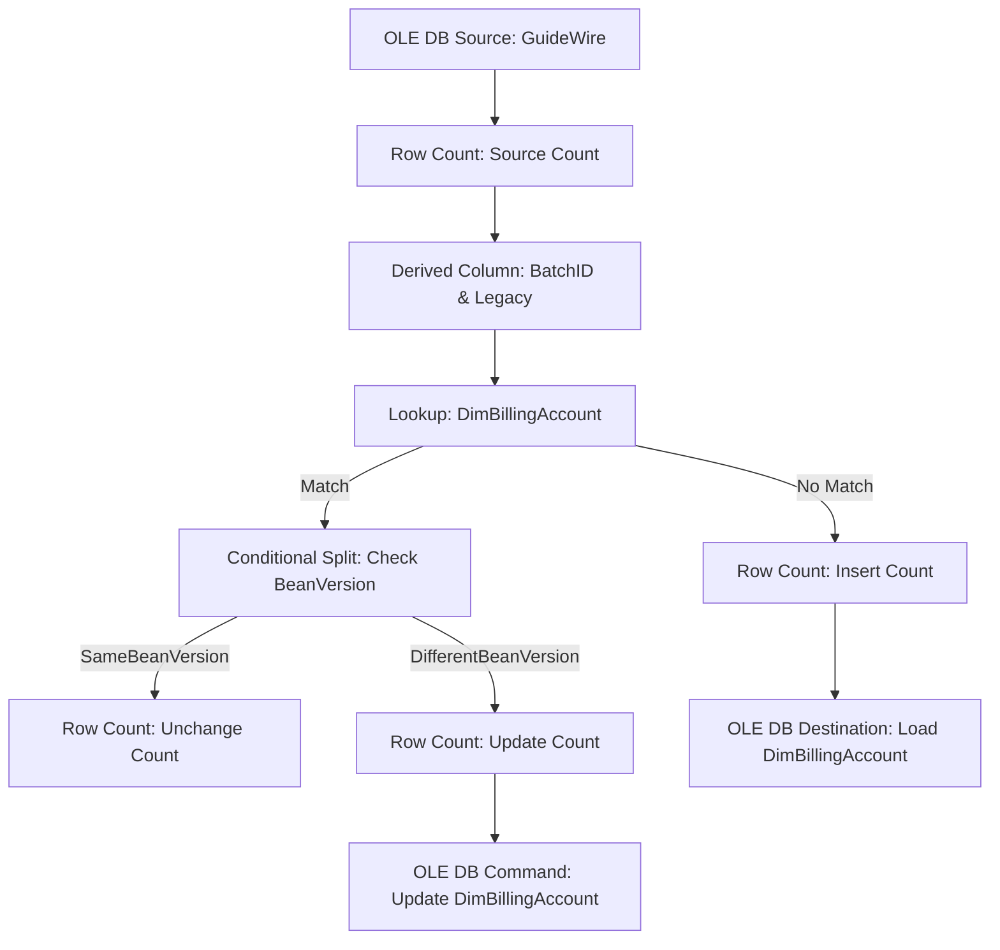

# EDW_BC_Load_DimBillingAccount – SSIS Data Flow Documentation

## **Architecture Diagram**

---

## **1. Physical Source Tables Involved**

### **A. Main OLE DB Source (GuideWire)**
- **bc_account**
- **bctl_accounttype**
- **bc_ParentAcct**
- **bctl_billinglevel**
- **bctl_customerservicetier**
- **bc_securityzone**
- **bc_accountcontact**
- **bc_accountcontactrole**
- **bctl_accountrole**
- **bc_contact**
- **bc_address**
- **bctl_state**
- **bctl_delinquencystatus**
- **bctl_accountsegment**

### **B. Lookup Reference Table**
- **DimBillingAccount**

> All tables above are treated as independent Snowflake sources per rule.

---

## **2. Joins Between Source Tables**

### **A. In OLE DB Source (GuideWire) SQL**
- **bc_account** LEFT JOIN **bctl_accounttype** ON at.ID = dt.AccountType
- **bc_account** LEFT JOIN **ParentAcct** (derived from bc_ParentAcct JOIN bc_account)
- **bc_account** LEFT JOIN **bctl_billinglevel** ON bl.ID = dt.BillingLevel
- **bc_account** LEFT JOIN **bctl_customerservicetier** ON cst.ID = dt.ServiceTier
- **bc_account** LEFT JOIN **bc_securityzone** ON sz.ID = dt.SecurityZoneID
- **bc_account** LEFT JOIN **InsuredInfo** (see below)
- **bc_account** LEFT JOIN **bctl_delinquencystatus** ON tlds.ID = dt.DelinquencyStatus
- **bc_account** LEFT JOIN **bctl_accountsegment** ON bas.ID = dt.Segment

#### **Subqueries**
- **ParentAcct**: bc_ParentAcct JOIN bc_account
- **InsuredInfo**: bc_accountcontact JOIN bc_accountcontactrole JOIN bctl_accountrole LEFT JOIN bc_contact LEFT JOIN bc_address LEFT JOIN bctl_state

### **B. Lookup Join**
- **Data Flow** PublicID (from OLE DB Source) = **DimBillingAccount.Publicid** (Lookup)

---

## **3. Transformations Applied (Execution Order Accurate)**

1. **Row Count: CNT - Source Count**
   - **Purpose:** Counts rows from OLE DB Source for auditing
   - **SSIS Variable:** `User::SourceCount`

2. **Derived Column: DRV - BatchID & Legacy**
   - **Purpose:** Adds/overwrites BatchID column
   - **Expression:** `@[User::BatchID]` (SSIS runtime variable)

3. **Lookup: LKP - DimBillingAccount**
   - **Purpose:** Looks up BeanVersion from DimBillingAccount based on PublicID
   - **Join:** DataFlow.PublicID = DimBillingAccount.Publicid
   - **Returned Column:** BeanVersion (as EDWBeanVersion)
   - **SQL:** `SELECT Publicid, BeanVersion FROM DimBillingAccount`

4. **Conditional Split: CSPL - Check BeanVersion**
   - **Purpose:** Compares BeanVersion from source vs lookup
   - **Condition:** `BeanVersion == EDWBeanVersion`
   - **Outputs:**
     - **SameBeanVersion:** Unchanged rows
     - **DifferentBeanVersion:** Changed rows

5. **Row Count: CNT - Unchange Count**
   - **Purpose:** Counts rows where BeanVersion is unchanged
   - **SSIS Variable:** `User::UnChangeCount`

6. **Row Count: CNT - Update Count**
   - **Purpose:** Counts rows where BeanVersion is different
   - **SSIS Variable:** `User::UpdateCount`

7. **Row Count: CNT - Insert Count**
   - **Purpose:** Counts rows from Lookup No Match output
   - **SSIS Variable:** `User::InsertCount`

---

## **4. Final Target Table and Load Behavior**

### **Target Table**: **DIMBILLINGACCOUNT**
- **Load Type:** INSERT (for new rows via OLE DB Destination)
- **Load Type:** UPDATE (for changed rows via OLE DB Command)
- **Source Dataset:** Data after all joins and transformations
- **Incremental/SCD Behavior:**
  - SCD Type 1: BeanVersion comparison; only changed rows are updated
  - New rows inserted, unchanged rows ignored

---

## **5. Full End-to-End Architecture and Execution Flow**

1. **Extract** data from OLE DB Source (GuideWire) using a complex SQL with multiple joins and subqueries.
2. **Row Count** for auditing (User::SourceCount)
3. **Add BatchID** via Derived Column (User::BatchID)
4. **Lookup** BeanVersion in DimBillingAccount (PublicID join)
5. **Conditional Split** on BeanVersion equality:
    - **SameBeanVersion:** Count as unchanged (User::UnChangeCount)
    - **DifferentBeanVersion:** Count as update (User::UpdateCount)
6. **Insert Path:** Rows not found in lookup (Lookup No Match Output) are counted (User::InsertCount) and inserted into DimBillingAccount
7. **Update Path:** Rows with changed BeanVersion are updated in DimBillingAccount via OLE DB Command
8. **Audit** variables tracked for process completion

---

## **6. SSIS Variables (Preserved Verbatim)**
- `@[User::BatchID]`
- `@[User::IncrementDays]`
- `@[User::SourceCount]`
- `@[User::InsertCount]`
- `@[User::UpdateCount]`
- `@[User::UnChangeCount]`

---

## **7. Additional Notes**
- **All sources and targets are treated as Snowflake tables.**
- **No credentials or platform specifics are stored.**
- **All logic and expressions are taken verbatim from SSIS.**
